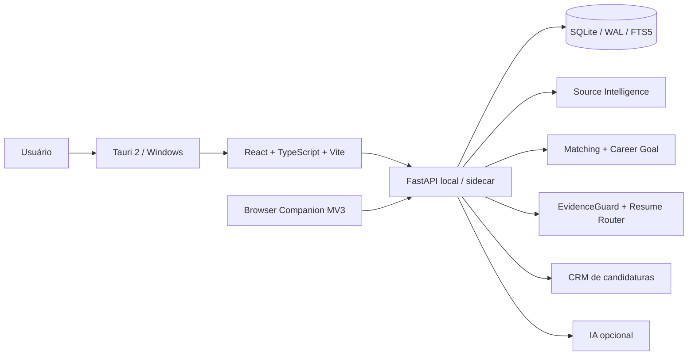

# Carreira Pessoal

> **Career intelligence local-first para Windows:** um produto pessoal que descobre e organiza oportunidades, separa aderência técnica de direção profissional, usa evidências como fonte de verdade e mantém o envio final sob controle humano.

[](https://github.com/Mayconxzdev/CarreiraPessoal/actions/workflows/portfolio-check.yml)
[](https://github.com/Mayconxzdev/CarreiraPessoal/actions/workflows/python-tests.yml)


[English](README.en.md) · [Arquitetura](docs/ARCHITECTURE.md) · [Decisões](docs/DECISIONS.md) · [Privacidade](docs/PRIVACY.md) · [Case técnico](docs/CASE_STUDY.md)

## O problema que transformei em produto

Criei o **Carreira Pessoal** para resolver a minha própria rotina de busca: tempo gasto procurando vagas, resultados duplicados, currículo/evidências desatualizados e o risco de priorizar uma oportunidade tecnicamente parecida que não leva à direção profissional desejada.

```text
descobrir → validar → deduplicar → Career Goal Gate → matching
         → evidências → Resume Router → Fitness Gate
         → revisão humana → acompanhamento
```

O sistema é usado na minha rotina e foi desenhado para continuar útil **sem IA**. Modelos locais ou endpoints compatíveis entram como reforço opcional, não como dependência do núcleo.

## O que vale observar

| Decisão | Por que existe |
|---|---|
| **Career Goal Gate** | Match técnico não significa que a vaga é boa para a direção de carreira. |
| **EvidenceGuard** | Métricas, senioridade, produção e outras alegações sensíveis exigem evidência específica. |
| **Resume Router + Fitness Gate** | O currículo só é tratado como pronto após regras de ATS, snapshot, direção, fit e evidências. |
| **Source Intelligence** | Fontes são avaliadas por saúde, latência, unicidade e rendimento, não apenas volume. |
| **Local-first** | Perfil, histórico e dados de trabalho permanecem no computador por padrão. |
| **Human-in-the-loop** | O produto prepara e auxilia; CAPTCHA, decisão e envio final continuam humanos. |

## Produto real

A versão `12.5.2` possui interface desktop para **Hoje**, **Oportunidades**, **Candidaturas**, **Carreira**, **Perfil**, **Fontes** e **Recursos**, além de Browser Companion para Chrome/Edge.

Em um recorte real de uso registrado durante a auditoria pública, o painel de fontes mostrou **21 fontes, 528 resultados brutos e 328 oportunidades únicas**. É uma fotografia operacional, não um benchmark permanente.

O projeto reconhece **102 famílias ATS/career platforms**; **11 têm coletores diretos dedicados** no código atual. As demais não são vendidas como integrações diretas quando não existe uma interface pública confiável.

## Arquitetura do produto completo



**Stack do produto:** Python 3.12, FastAPI, Pydantic, SQLAlchemy/Alembic, React, TypeScript, Vite, Tauri 2/Rust, SQLite/WAL/FTS5, Chrome/Edge MV3, PyInstaller e NSIS. Recursos opcionais incluem Ollama/LM Studio, embeddings locais, SearXNG e banco vetorial.

## Código publicado para revisão

Este repositório é a **edição pública de portfólio**. Em vez de publicar perfil, banco local, histórico de candidaturas e todo o workspace pessoal, ele expõe documentação arquitetural e trechos reais sanitizados das partes que melhor demonstram as decisões do produto:

- [`examples/career_goal.py`](examples/career_goal.py) — gate determinístico de direção profissional;
- [`examples/evidence_guard.py`](examples/evidence_guard.py) — bloqueio de alegações sem evidência suficiente;
- [`examples/resume_router.py`](examples/resume_router.py) — roteamento e fitness gate do currículo.

Os exemplos preservam a lógica do código auditado, mas dependências e dados pessoais do workspace não fazem parte da edição pública. Isso é intencional.

## Qualidade e evidências

Na versão-fonte `12.5.2`, a última validação registrada em **13/08/2026** foi:

```text
283/283 testes Python PASS
6/6 validações adicionais PASS
compileall app+tests PASS
node --check Browser Companion PASS
```

A CI deste repositório público faz outra função: verifica a estrutura da edição de portfólio, compila os exemplos publicados e executa o safety scan. A evidência de release e a CI pública são mantidas separadas para não fingir que um subconjunto público executa toda a suíte do workspace completo.

## Segurança e automação responsável

- IA não é requisito do core;
- `AUTO_SUBMIT_ENABLED=false` por padrão no produto completo;
- CAPTCHA não é contornado;
- vagas e HTML externos são entrada não confiável, não instruções de sistema;
- providers customizados em nuvem exigem transporte seguro;
- segredos ficam separados da configuração comum;
- backup/restore valida integridade e rejeita path traversal;
- o envio final continua sob decisão humana.

Veja [Privacidade](docs/PRIVACY.md) e [Decisões](docs/DECISIONS.md).

## Por que publiquei assim

Meu objetivo com este repositório não é mostrar o maior número possível de arquivos. É permitir que um recrutador ou engenheiro entenda rapidamente **o problema, as decisões, os trade-offs e exemplos reais do código**, sem expor dados da minha busca pessoal.

## Autoria

Projeto pessoal concebido e desenvolvido por **Maycon Ferreira**. Uso ferramentas de IA como apoio de pesquisa e desenvolvimento, mas requisitos, arquitetura, revisão, testes, troubleshooting e decisões finais permanecem sob minha responsabilidade.

[Portfólio](https://mayconxzdev.github.io/) · [GitHub](https://github.com/Mayconxzdev) · [LinkedIn](https://www.linkedin.com/in/maycon-ferreira-7bb870231/)
