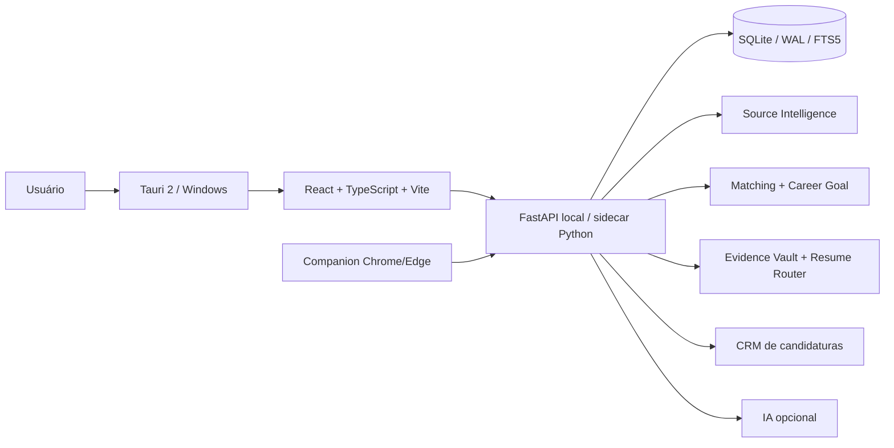

# Carreira Pessoal

> **Career intelligence local-first para Windows:** descobre oportunidades, valida aderência à direção profissional, organiza evidências, prepara currículo e acompanha candidaturas em um fluxo único.


## Por que existe

Criei o **Carreira Pessoal** para resolver problemas da minha própria rotina: tempo gasto procurando vagas, oportunidades duplicadas, manutenção constante de currículo/evidências e dificuldade de separar uma vaga tecnicamente parecida de uma oportunidade que realmente faz sentido para a direção de carreira.

```text
descobrir → validar → deduplicar → Career Goal Gate → matching → evidências
         → Resume Router → Fitness Gate → revisão → acompanhamento
```

O núcleo é **local-first** e funciona sem IA. Modelos locais ou endpoints compatíveis entram apenas como reforço opcional.

## O que o projeto demonstra

- **Career Goal Gate:** separa compatibilidade técnica de direção profissional;
- **Evidence Vault:** perfil, currículo, GitHub e portfólio formam uma fonte de verdade versionada;
- **Resume Router + Fitness Gate:** seleciona evidências sustentadas e valida a preparação antes do uso;
- **Source Intelligence:** acompanha saúde, latência, unicidade e rendimento das fontes;
- **CRM de candidaturas:** registra evolução do processo sem perder contexto;
- **Browser Companion:** auxilia análise e preparação no navegador, mantendo a decisão final com o usuário;
- **IA adaptável:** Ollama, LM Studio e endpoints compatíveis são opcionais;
- **Distribuição Windows:** Python/FastAPI empacotado como sidecar, frontend React e shell Tauri/NSIS.

## Interface real

A versão `12.5.2` possui telas funcionais para **Hoje**, **Oportunidades**, **Candidaturas**, **Carreira**, **Perfil**, **Fontes** e **Recursos**. Em uma execução real registrada durante a auditoria, o painel de fontes exibiu **21 fontes**, **528 resultados brutos** e **328 oportunidades únicas**. Esses números representam apenas aquele recorte de execução e variam conforme configuração e disponibilidade das fontes.

## Arquitetura



### Stack

| Camada | Tecnologias |
|---|---|
| Desktop | Tauri 2, Rust, NSIS |
| Frontend | React, TypeScript, Vite, TanStack Query |
| Engine | Python 3.12, FastAPI, Pydantic, SQLAlchemy, Alembic |
| Dados | SQLite, WAL, FTS5 |
| Descoberta | coletores ATS, JobSpy auxiliar, fontes brasileiras, SearXNG opcional |
| Matching | regras determinísticas, texto e embeddings locais opcionais |
| IA | provider-agnostic; local ou endpoint compatível |
| Extensão | Chrome/Edge MV3 Side Panel |
| Qualidade | pytest, compileall, Ruff e gates de release |
| Distribuição | PyInstaller sidecar + Tauri/NSIS |

## Descoberta de vagas

O registry atual reconhece **102 famílias ATS/career platforms**. **11 possuem coletores diretos dedicados**; outras famílias são reconhecidas/capturadas sem serem apresentadas como integrações diretas quando não existe uma interface pública confiável.

## Decisões de produto

O projeto prioriza controle e explicabilidade: dados locais por padrão, evidência antes de geração, IA opcional, histórico versionado e revisão humana antes de qualquer ação externa. As decisões e trade-offs estão documentados em [`docs/DECISIONS.md`](docs/DECISIONS.md).

## Validação

**Versão auditada:** `12.5.2`

Última validação de fonte registrada em 13/08/2026:

```text
283/283 testes Python PASS
6/6 validações adicionais PASS
compileall app+tests PASS
node --check Companion PASS
```

O instalador Windows possui um gate separado de build, instalação limpa, smoke test, reinstalação e desinstalação. A documentação não promove um instalador como final antes desse ciclo ficar verde.

Veja [`docs/TESTING.md`](docs/TESTING.md), [`docs/ARCHITECTURE.md`](docs/ARCHITECTURE.md), [`docs/PRIVACY.md`](docs/PRIVACY.md) e [`docs/PUBLIC_RELEASE_AUDIT.md`](docs/PUBLIC_RELEASE_AUDIT.md).

## Estrutura

```text
app/                    engine FastAPI, domínio, coletores e serviços
frontend/               React + TypeScript + Vite
apps/desktop/            Tauri 2 / Rust / NSIS
tests/                   suíte automatizada
packaging/windows/       build, contratos e smoke do instalador
tools/                   gates de implementação/release
data/                    bootstrap público genérico
docs/                    arquitetura, produto, privacidade e testes
```

## Autoria

Projeto pessoal concebido e desenvolvido por **Maycon Ferreira** para resolver a própria rotina de busca e candidatura. Requisitos, arquitetura, revisão, testes, troubleshooting e decisões de produto são tratados como parte do trabalho de engenharia, inclusive quando ferramentas de IA são usadas durante o desenvolvimento.

**Maycon Ferreira** — Automação, IA aplicada, integrações e sistemas internos.  
[GitHub](https://github.com/Mayconxzdev) · [Portfólio](https://mayconxzdev.github.io/)
