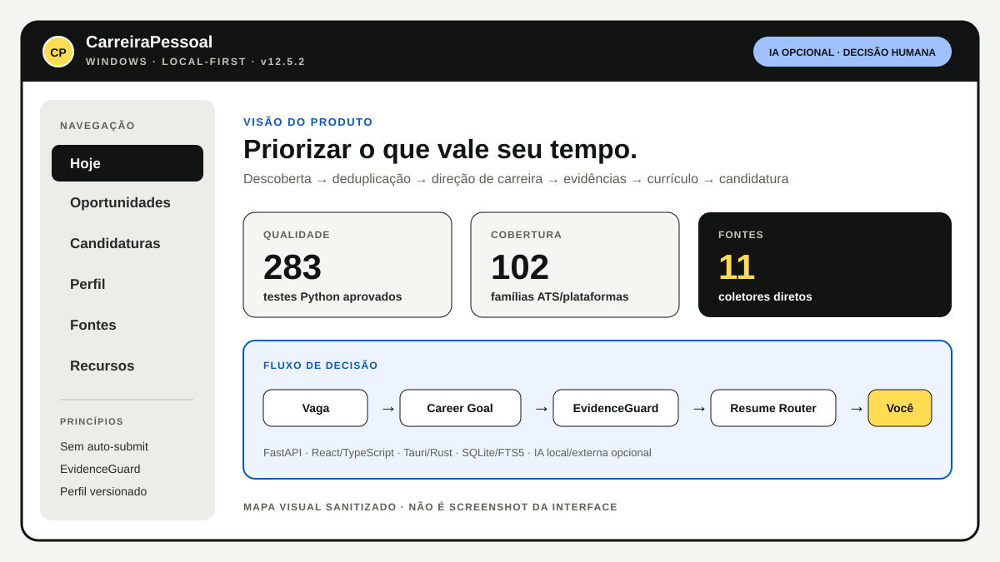
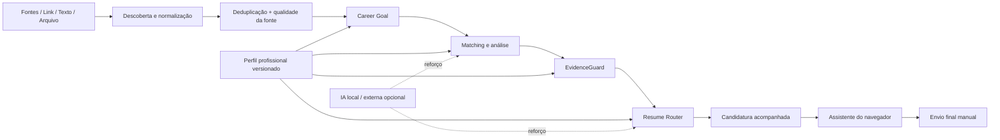

<div align="center">

# CarreiraPessoal

**Produto Windows local-first para organizar descoberta de vagas, direção de carreira, evidências e currículo — sem auto-submit.**

[](https://github.com/Mayconxzdev/CarreiraPessoal/actions/workflows/portfolio.yml)


[Portfólio](https://mayconxzdev.github.io/cases/carreira-pessoal/) · [Arquitetura](docs/ARCHITECTURE.md) · [Guia de revisão](docs/CODE_REVIEW_GUIDE.md) · [Testes](docs/TESTING.md) · [AI System Card](docs/AI_SYSTEM_CARD.md)

</div>

> Aplicativo que criei para organizar minha própria busca de vagas: descobrir oportunidades, evitar duplicidade, comparar a vaga com o meu objetivo profissional, manter evidências atualizadas e preparar o currículo certo sem enviar nada sozinho.

## Por que eu fiz

Eu estava gastando tempo procurando vagas em vários sites, revendo as mesmas oportunidades e atualizando currículo e evidências manualmente. A ideia do CarreiraPessoal foi juntar isso em um fluxo só e deixar a parte repetitiva por conta do sistema, mantendo a decisão final comigo.

O produto **funciona sem IA** no núcleo. IA local ou externa entra como reforço opcional para tarefas em que realmente acrescenta valor.

**Estado atual:** produto pessoal em uso · **v12.5.2**

## O produto por dentro

<p align="center">
  
</p>

O visual acima é um **mapa sanitizado do produto, não uma captura da interface**. Ele mantém a navegação, os principais controles e as métricas que podem ser mostradas publicamente sem depender de um arquivo externo do portfólio. Candidaturas, credenciais e dados pessoais continuam fora desta edição. O [case do portfólio](https://mayconxzdev.github.io/cases/carreira-pessoal/) explica o fluxo com mais contexto.

## O que já está funcionando

- descoberta em múltiplas fontes com deduplicação e medição de rendimento por fonte;
- entrada de vaga por **link, descrição ou arquivo**;
- Career Goal Gate para evitar priorizar vaga tecnicamente parecida, mas fora da direção profissional configurada;
- matching semântico local e análise de aderência;
- perfil profissional versionado com currículo, GitHub, portfólio, fatos e projetos;
- EvidenceGuard para bloquear afirmações sensíveis sem evidência suficiente;
- Resume Router/Fitness para selecionar e preparar o currículo adequado;
- acompanhamento da candidatura em linha do tempo;
- extensão/assistente de navegador para ajudar no preenchimento, mantendo o **envio final manual**;
- recursos locais opcionais como Ollama, LM Studio, containers, SearXNG e Qdrant;
- funcionamento adaptável ao computador, sem tornar esses recursos obrigatórios.

## Números desta versão

| Evidência | Estado registrado |
| --- | ---: |
| Testes Python | **283/283 aprovados** |
| Validações adicionais | **6/6 aprovadas** |
| Compileall | aprovado |
| Famílias ATS reconhecidas | **102** |
| Coletores diretos | **11** |

Esses números são da versão completa auditada que uso. Este repositório é uma **edição pública sanitizada e voltada à avaliação técnica**: não exponho meu banco pessoal, candidaturas, credenciais, dados de terceiros nem toda a árvore privada do aplicativo.

## Stack

`Python` · `FastAPI` · `SQLAlchemy` · `SQLite/WAL/FTS5` · `React` · `TypeScript` · `Vite` · `Tauri v2 / Rust` · `browser extension MV3` · `Docker/Podman opcional` · `Ollama/LM Studio opcional`

## Como organizei a arquitetura



A arquitetura e as decisões principais estão detalhadas em [`docs/ARCHITECTURE.md`](docs/ARCHITECTURE.md) e [`docs/DECISIONS.md`](docs/DECISIONS.md). A fronteira entre IA, evidência, privacidade, provedores e decisão humana está documentada em [`docs/AI_SYSTEM_CARD.md`](docs/AI_SYSTEM_CARD.md).

## Se quiser avaliar o código, comece aqui

Esta edição pública traz módulos representativos retirados e sanitizados da versão completa:

1. [`examples/career_goal.py`](examples/career_goal.py) — gate determinístico de direção profissional;
2. [`examples/evidence_guard.py`](examples/evidence_guard.py) — valida claims contra fatos/projetos atuais e trata métricas, senioridade, produção e liderança de forma conservadora;
3. [`examples/resume_router.py`](examples/resume_router.py) — roteamento/fitness de currículo;
4. [`docs/ARCHITECTURE.md`](docs/ARCHITECTURE.md) — visão da arquitetura;
5. [`docs/TESTING.md`](docs/TESTING.md) — estratégia e evidências de teste;
6. [`docs/AI_SYSTEM_CARD.md`](docs/AI_SYSTEM_CARD.md) — papel da IA, controles, riscos e dependências externas.

> Os arquivos em `examples/` são **trechos sanitizados**, não um pacote standalone. Algumas dependências (`app.models`, serviços e banco) pertencem ao workspace privado porque contêm a implementação completa e estruturas ligadas ao meu uso pessoal.

## Segurança e limites que eu escolhi de propósito

- não existe auto-submit de candidatura;
- CAPTCHA, termos do site e confirmação final continuam humanos;
- dados pessoais e credenciais não fazem parte da edição pública;
- IA não cria experiência profissional nem métricas que não estejam no perfil/evidências;
- o sistema pode funcionar sem provedor de IA;
- extensões e recursos opcionais não viram dependências obrigatórias do núcleo.

Mais detalhes em [`docs/PRIVACY.md`](docs/PRIVACY.md) e [`docs/AI_SYSTEM_CARD.md`](docs/AI_SYSTEM_CARD.md).

## O que eu faria diferente hoje

O projeto cresceu bastante desde a primeira versão. Se eu começasse de novo, eu definiria mais cedo a separação entre **núcleo obrigatório**, **recursos opcionais** e **integrações externas**. Foi uma das lições que mais ajudou nas versões recentes: o aplicativo ficou mais portátil e previsível quando parei de tratar ferramentas extras como parte obrigatória do produto.

Também passei a separar melhor **aderência técnica** de **direção de carreira**. Uma vaga pode combinar com minhas tecnologias e ainda assim não me levar para o tipo de trabalho que eu quero; por isso o Career Goal virou um componente próprio.

## Testes

A versão completa possui suíte automatizada muito maior do que esta edição pública. No material público eu priorizo componentes que um recrutador ou engenheiro consiga inspecionar sem expor minha base pessoal.

```text
v12.5.2
283/283 testes Python aprovados
6/6 validações adicionais aprovadas
compileall aprovado
```

## Autor

**Maycon Ferreira**  
Analista de Automação, IA e Integrações  
[Portfólio](https://mayconxzdev.github.io/) · [LinkedIn](https://www.linkedin.com/in/maycon-ferreira-7bb870231/)
