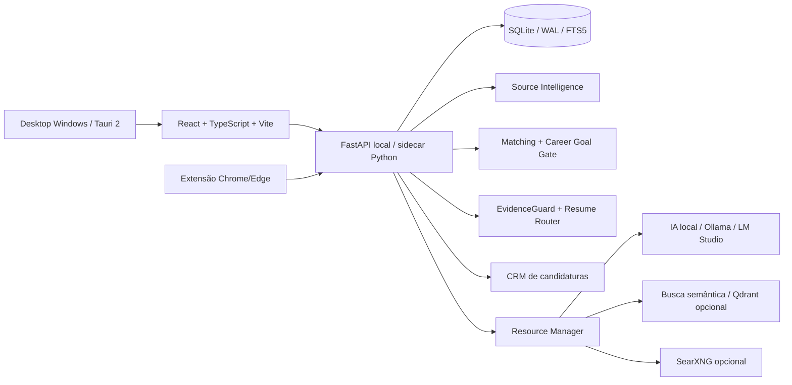

# Arquitetura

## Princípios

1. **Local-first:** dados de carreira permanecem locais por padrão.
2. **Sem IA obrigatória:** descoberta, deduplicação, tracking e regras principais continuam funcionais sem LLM.
3. **Evidência antes de geração:** currículos e respostas devem usar somente fatos sustentados pelo perfil versionado.
4. **Human-in-the-loop:** o sistema prepara; a decisão e o envio final pertencem ao usuário.
5. **Adaptabilidade:** fontes, modelos e recursos externos são opcionais e substituíveis.

A documentação evita tratar integrações opcionais como dependências obrigatórias ou como evidência de uso em produção fora do ambiente pessoal.
